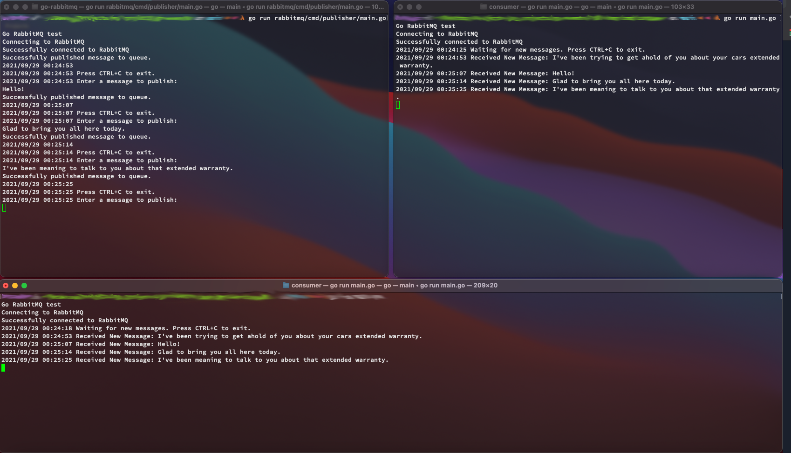

# Simple Pub/Sub model with Go and RabbitMQ

In order to run this application, you'll need to first run RabbitMQ in a docker container:

```shell
docker run -d --hostname rabbitmq --name test-rabbit -p 15672:15672 -p 5672:5672 rabbitmq:3-management
```

Once docker is up, you can ensure RMQ is working by visiting http://localhost:15672/ in your browser. You should get the RMQ admin panel. 

The login for the admin panel is 'guest', password is also 'guest'.


After you've ensured RMQ is working, make sure your working directory is 'go-events/rabbitmq', and run the publisher app with:  
`go run ./pubsub/cmd/server/main.go`

Then start the consumer app:
`go run ./pubsub/cmd/consumer/main.go`

You should see a message printed on the consumer app's screen.
You may start as many consumers as you'd like. They will all subscribe to the same publisher.


You may write messages to the publisher and it will publish them to the queue, to be consumed by the consumers.
The publisher is set to loop forever until you press CTRL+C. 

**Note**: VSCode will be very buggy if you try to run this inside of its terminal. I recommend using a cmd terminal or powershell on Windows, or a console on Mac/Linux.

You may also publish messages, among other things, by logging in as the rabbitmq admin inside the docker container:

```shell
docker exec -it DOCKER_CONTAINER_NAME bash   
```

once logged into your container, you can run:

```shell
rabbitmqadmin publish exchange="warranty" routing_key="" payload="Your Message Here"
```

</br>

### Example:

